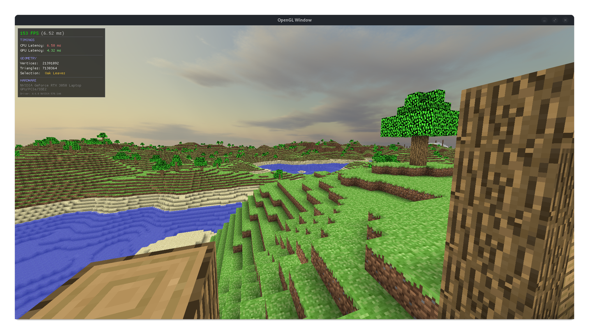
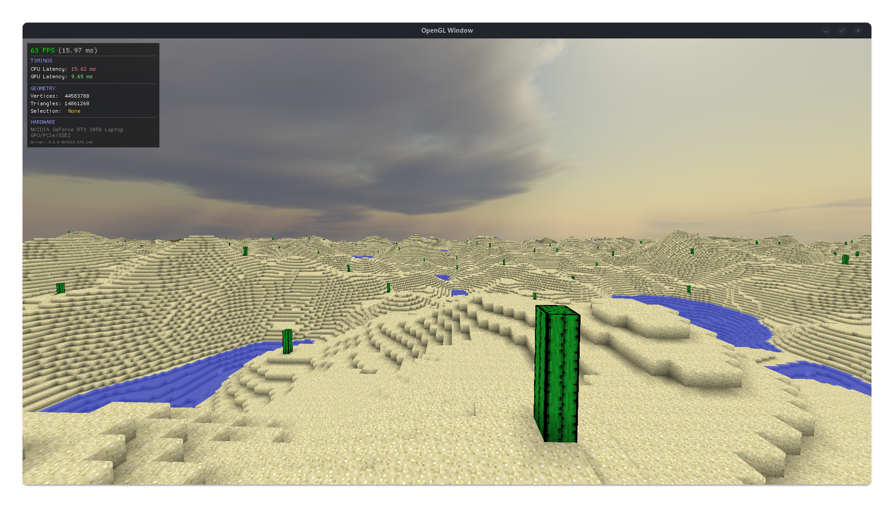

# Voxel Engine

I built this multithreaded voxel engine from scratch using C++20 and OpenGL 4.6 to push my understanding of graphics programming and memory management. It features an infinite, procedurally generated world that streams in chunks on background threads to prevent lag. The rendering pipeline is optimized with vertex bit-packing and face culling to keep frame rates high.



## Technical Highlights

### Multithreading & Concurrency
* **Custom Thread Pool:** Implemented a lightweight `ThreadPool` that manages a queue of worker threads.
* **Asynchronous Mesh Generation:** Offloads heavy chunk geometry generation to background threads, ensuring the main render loop remains non-blocking and preventing frame stutters during world streaming.
* **Thread Safety:** Utilizes `std::mutex` and `std::lock_guard` to synchronize access between the generation threads and the main render thread.

### Memory & GPU Optimization
* **Vertex Data Packing:** Drastically reduced memory bandwidth by compressing vertex attributes. Vertex position, texture coordinates, and ambient occlusion levels are bit-packed into integer data on the CPU before upload.
* **Face Culling:** Implemented neighbor-aware culling to discard hidden geometry between blocks, significantly reducing the vertex count per chunk.
* **Greedy Resource Management:** Chunks are dynamically loaded and unloaded based on a radial distance from the player to manage RAM usage efficiently.

### Rendering Pipeline
* **Batched Rendering:** Chunks are rendered via optimized VBO/VAO layouts to minimize draw overhead.
* **Texture Atlasing:** Combines block textures into a single atlas to minimize texture unit state changes and improve batching performance.
* **Ambient Occlusion:** Calculates vertex-based Ambient Occlusion (AO) on the CPU to add depth to voxel geometry without the cost of screen-space post-processing.

### Procedural Generation
* **Noise-Based Biomes:** Utilizes multiple noise layers (Perlin, Cellular, OpenSimplex2) to generate height, temperature, and humidity maps, creating distinct biomes like Deserts, Plains, and Tundras.
* **Infinite Terrain:** Supports seamless infinite world generation through a chunk-based coordinate system.

## Tech Stack
* **Language:** C++20 (Smart pointers, Lambda functions)
* **Graphics:** OpenGL 4.6, GLSL
* **Libraries:** GLFW, GLAD, GLM, FastNoiseLite, STB Image

## Build
```bash
mkdir build && cd build
cmake ..
make
./voxelEngine
